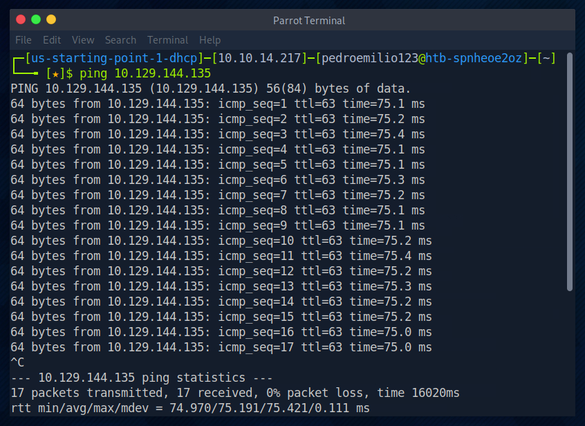
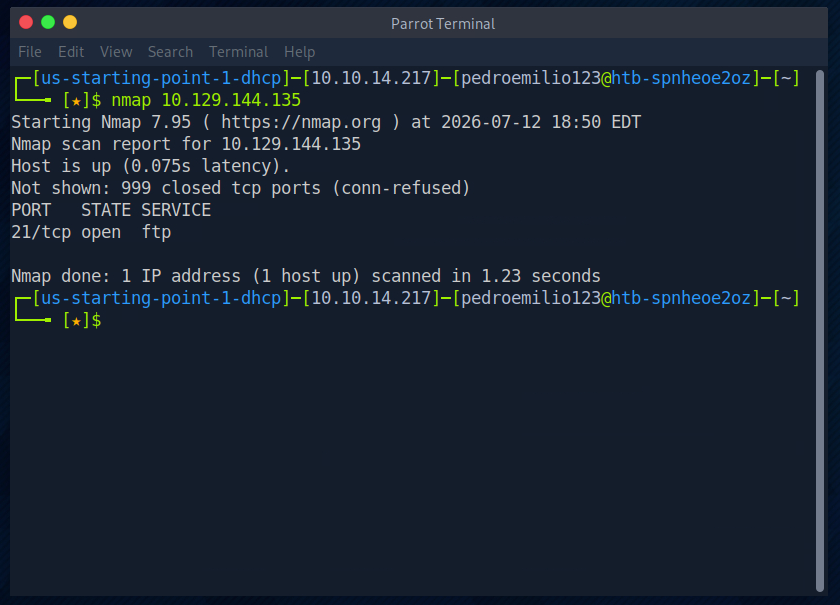
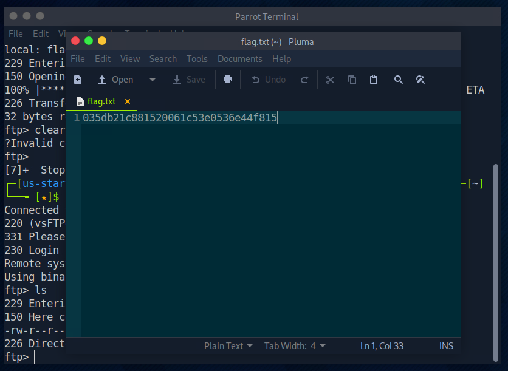

# HTB Starting Point — Fawn

**Platform:** Hack The Box — Starting Point (Tier 0)  
**Machine:** Fawn  
**Difficulty:** Very Easy  
**Date:** 2026-07-12  

---

## Objective

Gaining unauthorized access to the target machine and capturing the proof-of-compromise flag (`flag.txt`).

---

## Technical Questions & Tasks

### Task 1 — What does the 3-letter acronym FTP stand for?

**Answer:** `File Transfer Protocol`

### Task 2 — Which port does the FTP service listen on usually?

**Answer:** `21`

### Task 3 — FTP sends data in the clear, without any encryption. What acronym is used for a later protocol designed to provide similar functionality to FTP but securely, as an extension of the SSH protocol?

**Answer:** `SFTP`

### Task 4 — What is the command we can use to send an ICMP echo request to test our connection to the target?

**Answer:** `ping`

### Task 5 — From your scans, what version is FTP running on the target?

**Answer:** `vsftpd 3.0.3`

### Task 6 — From your scans, what OS type is running on the target?

**Answer:** `Unix`

### Task 7 — What is the command we need to run in order to display the 'ftp' client help menu?

**Answer:** `ftp -?`

### Task 8 — What is username that is used over FTP when you want to log in without having an account?

**Answer:** `anonymous`

### Task 9 — What is the response code we get for the FTP message 'Login successful'?

**Answer:** `230`

### Task 10 — There are a couple of commands we can use to list the files and directories available on the FTP server. One is dir. What is the other that is a common way to list files on a Linux system.

**Answer:** `ls`

### Task 11 — What is the command used to download the file we found on the FTP server?

**Answer:** `get`

---

## Step-by-Step Exploitation

### 1. Reconnaissance & Enumeration

The first step was checking network connectivity to the target host (`10.129.144.135`) using the `ping` command (Task 4).

With the host confirmed active, an Nmap port scan was performed to discover open ports and running services. A fast scan identified **Port 21** as open.

Next, a service version detection scan (`nmap -sV`) was executed to fingerprint the exact software running on the open port. The scan revealed the service **vsFTPd 3.0.3** running on a **Unix** operating system (Task 5 & 6).

---

### 2. Exploitation (Anonymous FTP Access)

To check the options available for the command-line FTP client, the help menu flag was queried using `ftp -?` (Task 7).

Using the anonymous login configuration feature (Task 8), a connection attempt was initiated with the command `ftp -a 10.129.144.135`. The server accepted the connection and returned a **230 Login successful** response code (Task 9).

---

### 3. Post-Exploitation & Flag Retrieval

Once inside the FTP environment, listing the directory contents with `ls` revealed a file named `flag.txt` (Task 10). The command `get flag.txt` was executed to download the asset locally onto the attacking machine (Task 11).

Opening the downloaded file locally using the Pluma text editor revealed the flag string.

**Flag Secured** ✅

---

## Technical Summary

1. **Recon:** Checked open doors with `nmap` and discovered FTP (port 21).
2. **Exploit:** Connected via `ftp` using `anonymous` login access.
3. **Exfiltrate:** Explored the filesystem to capture `flag.txt`.

---

## Lessons Learned

*   **Disable Anonymous Authentication:** Leaving anonymous access enabled allows external threat actors to read, download, or potentially modify sensitive operational files without requiring valid credentials.
*   **Avoid Cleartext Protocols:** Standard FTP transmits data, credentials, and commands in plaintext. From a defensive perspective, monitoring tools (like Wireshark or an IDS) can easily sniff these packets. Secure alternatives like SFTP or FTPS should always be enforced.
*   **Enforce Principle of Least Privilege:** If a service requires public or broad read-access, the directory structure should be strictly isolated to prevent exposure of sensitive system administrative files or configuration data.
