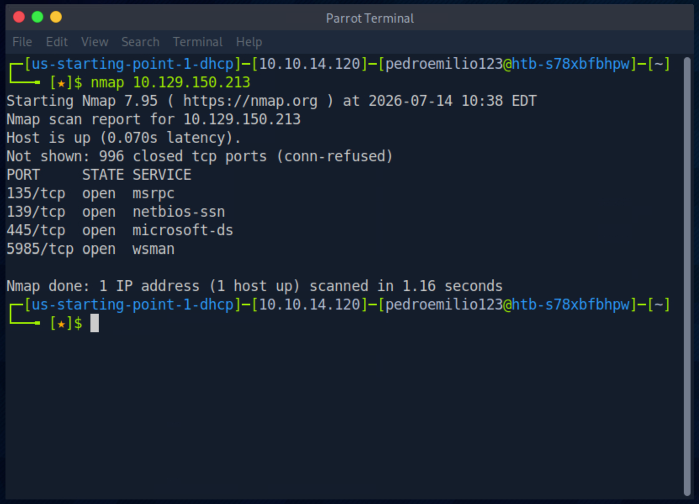

# HTB Starting Point — Dancing

**Platform:** Hack The Box — Starting Point (Tier 0)  
**Machine:** Dancing  
**Difficulty:** Very Easy  
**Date:** 2026-07-14  

---

## Objective

Obtaining unauthorized access to the target machine's network shares and retrieving the proof-of-compromise flag (`flag.txt`).

---

## Technical Questions & Tasks

### Task 1 — What does the 3-letter acronym SMB stand for?
**Answer:** `Server Message Block`

### Task 2 — What port does SMB use to operate at?
**Answer:** `445`

### Task 3 — What is the service name for port 445 that came up in our Nmap scan?
**Answer:** `microsoft-ds`

### Task 4 — What is the 'flag' or 'switch' that we can use with the smbclient utility to 'list' the available SMB shares on Dancing?
**Answer:** `-L`

### Task 5 — How many shares are there on Dancing?
**Answer:** `4`

### Task 6 — What is the name of the share we are able to access in the end with a blank password?
**Answer:** `WorkShares`

### Task 7 — What is the command we can use within the SMB shell to download the files we find?
**Answer:** `get`

### SUBMIT FLAG — Submit the flag located on the SMB share.
**Answer:** `15f61c10dfbc77a704d76016a22f1664`

---

## Step-by-Step Exploitation

### 1. Reconnaissance & Enumeration

An initial Nmap scan was run on the target IP (`10.129.150.213`) to identify open ports. The scan showed port **445/tcp** active with the service **microsoft-ds** (Task 2 & 3).

Since port 445 was open, we used the `smbclient` utility with the `-L` flag (Task 4) to list the available shares on the target machine. The scan returned **4** shares in total: `ADMIN$`, `C$`, `IPC$`, and `WorkShares` (Task 5).

---

### 2. Exploitation (Anonymous SMB Access)

We attempted to connect to the custom share `WorkShares`. When prompted for a password, we left it blank and pressed Enter. The server allowed us to bypass authentication, granting full access to the share (Task 6).

---

### 3. Post-Exploitation & Flag Retrieval

Once inside the share, running the `ls` command revealed two user directories: `Amy.J` and `James.P`.

We navigated into the `Amy.J` directory (`cd Amy.J`) and found a file named `worknotes.txt`.

We downloaded the notes file locally using the `get` command (Task 7). Opening it in the Pluma text editor revealed basic system tasks, such as starting an Apache server and configuring WinRM.

Next, we went back up to the root directory (`cd ..`) and entered the `James.P` folder (`cd James.P`). Running `ls` here revealed the target `flag.txt` file.

We downloaded the file using `get flag.txt` and opened it with Pluma to retrieve the flag.

**Flag Secured:** `15f61c10dfbc77a704d76016a22f1664`

---

## Technical Summary

1. **Reconnaissance:** Scanned the host using `nmap` and discovered an active SMB service on port 445.
2. **Exploitation:** Connected via `smbclient` using anonymous null session access (blank password) to the `WorkShares` directory.
3. **Exfiltration:** Explored the exposed directories to grab internal notes (`worknotes.txt`) and retrieve the target `flag.txt`.

---

## Lessons Learned

*   **Disable Anonymous Share Access:** Permitting anonymous null sessions on SMB shares leaves directories entirely exposed to anyone on the network. Access controls and proper authentication must be strictly enforced.
*   **Keep Sensitive Data Off Public Shares:** Storing administrative notes or system configurations on public-facing shares creates an easy path for information leakage.
*   **Enforce Strict Firewall Rules:** Block port 445 on public-facing network interfaces. Keep SMB access restricted only to trusted internal network zones.
