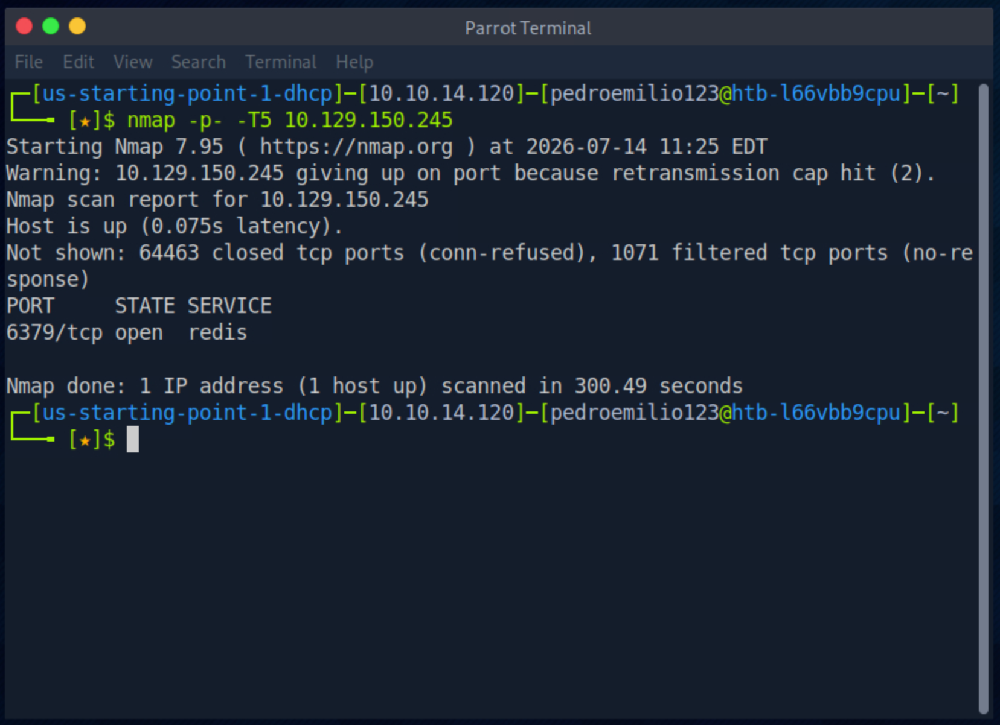

# HTB Starting Point — Redeemer

**Platform:** Hack The Box — Starting Point (Tier 0)  
**Machine:** Redeemer  
**Difficulty:** Very Easy  
**OS:** Linux  
**Date:** 2026-07-14  

---

## Objective

Redeemer is a very easy Linux machine which explores the enumeration and exploitation of a Redis database server, showcasing the `redis-cli` command-line utility and the basic commands used to interact with the Redis service in order to retrieve the flag stored in the database.

---

## Technical Questions & Tasks

### Task 1 — Which TCP port is open on the machine?
**Answer:** `6379`

### Task 2 — Which service is running on the port that is open on the machine?
**Answer:** `redis`

### Task 3 — What type of database is Redis?
**Answer:** `In-memory Database`

### Task 4 — Which command-line utility is used to interact with the Redis server?
**Answer:** `redis-cli`

### Task 5 — Which flag is used with the Redis command-line utility to specify the hostname?
**Answer:** `-h`

### Task 6 — Once connected to a Redis server, which command is used to obtain the information and statistics about the Redis server?
**Answer:** `info`

### Task 7 — What is the version of the Redis server being used on the target machine?
**Answer:** `5.0.7`

### Task 8 — Which command is used to select the desired database in Redis?
**Answer:** `select`

### Task 9 — How many keys are present inside the database with index 0?
**Answer:** `4`

### Task 10 — Which command is used to obtain all the keys in a database?
**Answer:** `keys *`

---

## Step-by-Step Exploitation

### 1. Reconnaissance & Enumeration

The first step was to map the attack surface with a full TCP port scan against the target (`10.129.150.245`).

```bash
nmap -p- -T5 10.129.150.245
```

We used `-p-` to scan **all** 65535 ports instead of relying on the default top 1000, since the relevant service is often placed on a non-standard port — we would rather pay the time cost than leave part of the surface unmapped. The `-T5` timing template speeds up the scan, which is acceptable in a controlled lab; in a real engagement it would be too noisy and would risk dropped packets.

The scan revealed a single open port: **6379/tcp**, identified as **redis** (Task 1 and 2).



Having only one open port simplifies the reasoning: all exploitation has to go through Redis. The logical next step is to confirm we can communicate with the service.

---

### 2. Connecting to the Redis Service

Since 6379 is the default Redis port, we connected directly with the native `redis-cli` client (Task 4), using the `-h` flag to specify the target host (Task 5).

```bash
redis-cli -h 10.129.150.245
```

The connection was established **without prompting for a password**. This is already the core finding of the machine: Redis is exposed without authentication, meaning anyone on the network has read/write access to the database.

Once connected, we ran the `info` command (Task 6) to gather information and statistics about the server.

```
10.129.150.245:6379> info
```

The output confirmed the server version — **redis_version:5.0.7** (Task 7) — along with other useful data (Linux 5.4.0 OS, *standalone* mode, config file at `/etc/redis/redis.conf`).


---

### 3. Enumerating the Keyspace

The most important section of the `info` output is the **# Keyspace** block, which lists the existing databases and how many keys each one holds:

```
# Keyspace
db0:keys=4,expires=0,avg_ttl=0
```

This answers Task 9: the database with index 0 holds **4 keys**. Redis organises data into numbered databases (0 to 15 by default), so the next step is to select the correct database and list its contents.

The `select` command is used to choose the database (Task 8). One important detail: the argument is the **numeric index**, not the label. Running `select db0` returned an error (`invalid DB index`) because `db0` is the label shown in the output, not the index — the correct form is `select 0`.

```
10.129.150.245:6379> select db0
(error) ERR invalid DB index
10.129.150.245:6379> select 0
OK
```


With the database selected, we listed all keys with `keys *` (Task 10):

```
10.129.150.245:6379> keys *
1) "numb"
2) "stor"
3) "temp"
4) "flag"
```


Out of the four keys, the one named `flag` is clearly the target. Worth noting: we initially tried `redis-cli keys *` **inside** the session and received an error — once inside the redis-cli prompt the binary name is no longer repeated, only the command itself is issued. It is a small mistake, but it illustrates the difference between the system shell context and the Redis interpreter context.

---

### 4. Post-Exploitation & Flag Retrieval

To read the value of a key, we use `get` followed by the key name:

```
10.129.150.245:6379> get flag
"03e1d2b376c37ab3f5319922053953eb"
```


**Flag Secured:** ✅

---

## Technical Summary

1. **Reconnaissance:** Scanned the host with `nmap -p-` and discovered a Redis service on port 6379.
2. **Access:** Connected anonymously to the service via `redis-cli -h`, with no authentication required.
3. **Enumeration:** Ran `info` to characterise the server and identify the keyspace, then `select 0` and `keys *` to enumerate the stored keys.
4. **Exfiltration:** Used `get flag` to read the value of the key containing the flag.

---

## Lessons Learned

* **Never Expose Redis Without Authentication:** by default, older Redis versions accept connections without a password. `requirepass` must be configured in `redis.conf` and, ideally, the bind address restricted to `127.0.0.1` so the service is never exposed to the network.
* **Isolate the Service at Network Level:** port 6379 should never be reachable from untrusted networks. Firewall rules and binding to loopback are the first line of defence.
* **Redis Is an In-Memory Database:** data lives in memory, which has implications for both performance and persistence/forensics — worth keeping in mind when analysing a compromised server.
